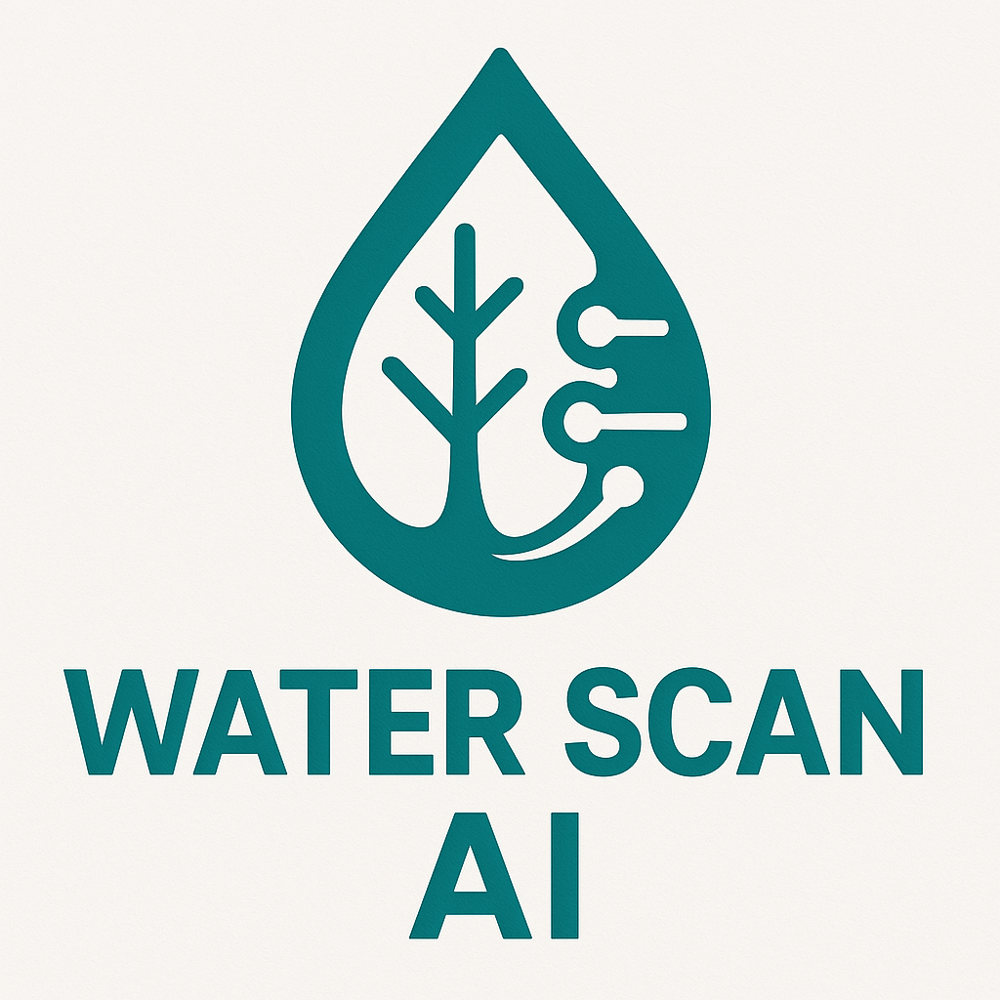

# Water Scan AI

💧 **Water Scan AI** is a Machine Learning project that classifies water potability using preprocessing techniques, class balancing, hyperparameter optimization, and model versioning with MLflow.

- **Project Name**: `water_scan_ai`
- **Author**: `tralencar`
- **Version**: "1.0.1"
- **License**: `MIT`
- **Keywords**: `quality`, `water`
- **Data Source**: [Dataset (Water Quality)](https://www.kaggle.com/datasets/adityakadiwal/water-potability/data) from Kaggle.

---

## 🔹 Visual Identity of the Water Scan AI logo

> The *Water Scan AI* logo is more than just a visual representation; it encapsulates the project’s core mission of **leveraging artificial intelligence to ensure water potability**.
> As a brand, it conveys **trust, innovation, and environmental responsibility**, positioning the solution as a **cutting-edge tool** for **water quality analysis and management**.
> The logo effectively combines elements of **technology** and **sustainability**, emphasizing the project’s commitment to **solving global water challenges** while ensuring the **accuracy and reliability** of its data-driven insights.

### 1. Simplicity and Clear Connection with Water
The central **water droplet icon** is universally recognized, instantly communicating the focus of the project on **water potability**. This symbol serves as a direct representation of the project’s mission to ensure access to safe drinking water.

- **Blue color**: Evokes **freshness, purity**, and **trust**, aligning with the values of sustainability and technological advancement. It represents **stability and reliability**, key factors for a project handling critical environmental data.

### 2. Geometric and Modern Lines: Representing Artificial Intelligence
The **geometric lines** surrounding the water droplet subtly represent **artificial intelligence** and **machine learning**. These modern shapes imply **precision, control**, and **advanced technology**.

- The clean, sharp lines suggest that the project is **data-driven** and powered by **AI**, reinforcing its technical sophistication and differentiation from traditional environmental monitoring systems.

### 3. The Blend of Technology and Sustainability
The integration of the water element with technology-centric lines and shapes visually represents the union of **environmental sustainability** and **innovative AI solutions**.

- This dual representation highlights the project’s aim to **solve environmental problems through advanced technologies** and demonstrates its commitment to **sustainable practices** in the realm of **water management**.

### 4. Integrated Branding Strategy
The visual identity of *Water Scan AI* is designed to **translate the project’s business goals into graphic elements**:

- **Technological innovation** (AI-driven data analysis)
- **Environmental sustainability** (focus on water quality and accessibility)
- **Global impact** (ensuring access to clean water)

This direct connection between **visual brand** and **project mission** improves **communication with stakeholders, partners, and users**, while enhancing **brand recognition**. It positions *Water Scan AI* as a **trustworthy, impactful, and cutting-edge solution** in the field of **water quality management**.

---

## 🔹 Features

✅ Programming Language: `Python`  
✅ Structured using the `Factory Method Pattern` for trainer creation  
✅ Uses the `Facade Pattern` in the logging module with MLflow (`MLFlowLogger`)  
✅ Uses the `Singleton Pattern` to manage entries in the MLflow Registry  
✅ Hyperparameter optimization with `Optuna`  
✅ Class balancing with `SMOTE` (imblearn)  
✅ Logging and tracking of experiments using `MLflow`  
✅ Model registration and versioning with `MLflow Model Registry`  
✅ Metric and artifact visualization with `matplotlib` and `MLflow`  
✅ Evaluation using `scikit-learn` metrics  
✅ Supports `Random Forest` models, with structure ready for XGBoost and LightGBM  
✅ Code quality tools: `Pre-commit`, `Ruff`, `Black`, `Flake8`, `Isort`  
✅ Task automation using `Makefile`  
✅ Semantic version control with `bump2version`  
✅ Automated testing with `Pytest` + `Pytest-Cov`  
✅ Auto-generated documentation using `MkDocs` + `MkDocs Material`  
✅ Automatic formatting and linting with `Ruff`, `Black`, and `Isort`  
✅ Git hook support for code validation using `Pre-commit`  
✅ Code structured using the `Singleton Pattern` for model registry management  
✅ Modular and reusable architecture using `Poetry` for dependency management  
✅ **Continuous Integration (CI)** with `GitHub Actions` for code quality validation, including:  
🔹 - Automated quality checks on every `push` or `pull request` to the `main` branch  
🔹 - Python environment setup with `Poetry`  
🔹 - Automatic installation of development dependencies  
🔹 - Execution of `make quality` rule to ensure code standardization  

---

## 🧪 Development Tools

- `ruff` — Linting and formatting
- `black` — Code formatter
- `isort` — Import ordering
- `flake8` — Linting
- `interrogate` — Docstring coverage checker
- `pytest`, `pytest-cov` — Unit testing and coverage
- `pre-commit` — Git hooks for automated code checks
- `bump2version` — Semantic version control
- `Optuna` — Hyperparameter optimization for model training
- `MLflow` — Experiment tracking and model management
- `Poetry` — Dependency management and virtual environment creation
- `Makefile` — Task automation for project workflows
- `Docker` — Containerization for environment consistency and service orchestration
- `MinIO` — Object storage for MLflow artifacts

---

## 🔹 Documentation Structure
- **[Installation](installation.md)**: How to set up the environment.
- **[Project Usage](usage.md)**: How to run the project.
- **[Project Structure](project_structure.md)**: File structure explanation.
- **[Methodology (CRISP-DM)](crisp_dm_stages.md)**: CRISP-DM methodology used in the project.
- **[Project Modules](modules_index.md)**: Technical reference.
- **[Contributing](contributing.md)**: How to contribute to the project.
- **[Tests](tests.md)**: Tests used in the project.
- **[Changelog](changelog.md)**: Version history.

---

# CRISP-DM Methodology in Water Scan AI

The **Water Scan AI** project adopted the **CRISP-DM** (Cross-Industry Standard Process for Data Mining) methodology to structure the end-to-end development of a water potability prediction solution. Below is a description of each phase as applied to this project.

---

## 📘 1. Business Understanding

The project began with a deep understanding of the water quality problem: **predicting water potability**. The strategic goal was to **enhance public health** and **ensure safe water access** through **predictive analytics**.

- **Primary objective**: Predict whether a water sample is **potable** (1) or **non-potable** (0) based on physical and chemical parameters.

---

## 📊 2. Data Understanding

The dataset was explored to understand its structure and identify patterns:

- **EDA techniques** like histograms, boxplots, KDE plots, and correlation heatmaps were applied.
- Observations included:
  - Potable water tended to have higher pH and lower turbidity.
  - Some water samples had significantly higher levels of sulfates and turbidity.
  - Certain features, such as **chloramines** and **conductivity**, were strongly correlated with potability.
- Missing values and outliers were identified and addressed during data preprocessing.

---

## 🛠 3. Data Preparation

In this phase, the dataset was cleaned and transformed:

- **Missing values** were handled using the median imputation technique.
- **Categorical features** were encoded, and numerical features were standardized.
- The target variable (`Potability`) was mapped to binary (0 or 1).
- **SMOTE** was applied to balance the classes.
- **Train-test split** was performed, ensuring stratification based on potability.

---

## 🤖 4. Modeling

Several models were trained and compared:

- **Random Forest**
- **XGBoost**

All models were evaluated with:

- `Accuracy`, `F1-Score`, `Precision`, `Recall`, `ROC AUC`
- Confusion matrices, feature importance, and learning curves were used for evaluation.

---

## ✅ 5. Evaluation

The models were assessed both quantitatively and visually:

- **Random Forest** was the best performer, achieving high accuracy and stable performance across different evaluation metrics.
- **Feature importance** revealed that variables such as `ph`, `hardness`, and `conductivity` were most predictive of water potability.

---

## 🎯 Summary

CRISP-DM provided a clear, iterative roadmap to:

- Understand the water potability prediction problem
- Prepare, model, and evaluate data scientifically
- Deliver **business-driven recommendations** to improve water quality monitoring and ensure safe water access

Water Scan AI is a **modular**, **interpretable**, and **reproducible** solution for predicting water potability, ensuring public health and environmental sustainability.

---
