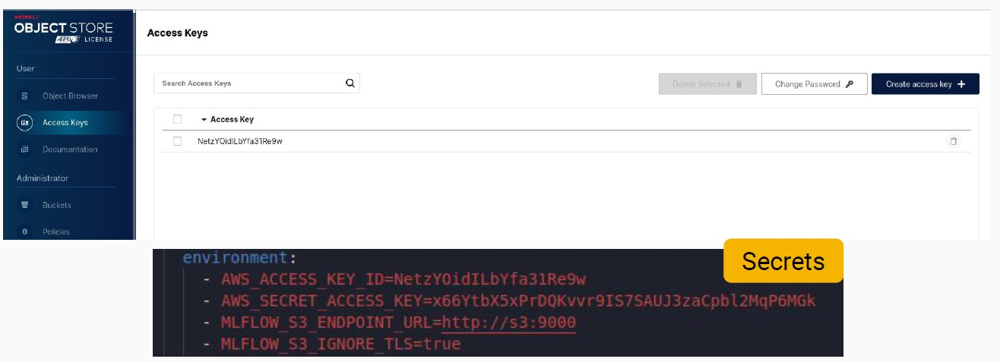
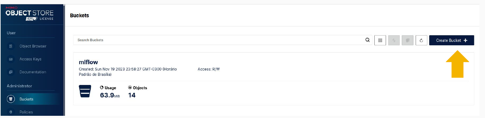
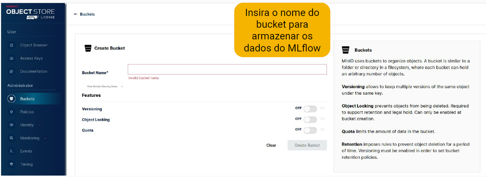

# Installation

## 🔹 About the Project

💧 **Water Scan AI** is a Machine Learning project that classifies water potability using preprocessing techniques, class balancing, hyperparameter optimization, and model versioning with MLflow.

- **Project Name**: `water_scan_ai`
- **Author**: `tralencar`
- **Version**: "1.0.1"
- **License**: `MIT`
- **Keywords**: `quality`, `water`
- **Data Source**: [Dataset (Water Quality)](https://www.kaggle.com/datasets/adityakadiwal/water-potability/data) from Kaggle.

---

## 🔹 Prerequisites

Before installing the project, make sure your environment meets the following requirements:

- **Python** `>=3.9, <4.0`
- **Git** installed
- **Poetry** for dependency management
- **Make** (Makefile support is included in dependencies)

---

## 🔹 Installing Dependencies

### 1️⃣ Clone the repository

```bash
git clone https://github.com/tralencar/water_scan_ai.git
cd water_scan_ai
```

---

### 2️⃣ Install Poetry (if not already installed)

`pip install poetry`

---

### 3️⃣ Configure Poetry to create virtual environments in the project folder

`poetry config virtualenvs.in-project true`

📌 Note:
* This will create a `.venv/` folder inside the project directory, helping with isolation and portability.

---

### 4️⃣ Activate the virtual environment

`poetry shell`

---

### 5️⃣ Install dependencies

`poetry install`

📌 Notes: <br>

* This will install all libraries listed in the `pyproject.toml`, including: <br>
* Data scraping and processing: `pandas`, `seaborn` <br>
* Machine Learning and optimization: `scikit-learn`, `xgboost`, `lightgbm`, `optuna`, `imblearn` <br>
* Experiment tracking and versioning: `mlflow` <br>
* Interactive notebooks: `jupyter` <br>
* Code quality and formatting: `black`, `isort`, `flake8`, `ruff`, `interrogate` <br>
* Testing: `pytest`, `pytest-cov` <br>
* Version control: `bump2version` <br>
* Pre-commit hooks: `pre-commit` <br>
* Documentation: `mkdocs`, `mkdocs-material`, `mkdocstrings-python`, `pymdown-extensions`, `mkdocs-bootstrap386`

---

### 🔹 Pre-commit Configuration

Pre-commit helps maintain code quality. To enable it, run:

`poetry run pre-commit install`

📌 Note: <br>

* From now on, every time you make a commit, `pre-commit` hooks will run automatically.

---
### 🔹 Verifying the Installation

To ensure everything was installed correctly, run:

`poetry run python -c "import pandas; print('Installation successful!')"`

📌 Note: <br>

* If the message "Installation successful!" appears, everything is properly configured.

---

## 🔹 MinIO + MLflow Integration Setup

To ensure secure model versioning, the `Water Scan AI` project uses **MinIO** as the **artifact store for MLflow**, simulating an S3-compatible interface. Model and metadata persistence is handled by:

* MinIO (S3-like storage for artifacts such as `.pkl`, `.onnx` models, images, metrics, etc.)
* PostgreSQL (backend store for logs, parameters, and experiment runs)

---

### 🔹 Creating an Access Key in MinIO

Access the MinIO dashboard (locally at `http://localhost:9001`) and create a new access key in the **Access Keys** menu.
Below is an example of the MinIO access screen and the corresponding environment variable configuration:



⚠️ Make sure the environment variables `AWS_ACCESS_KEY_ID` and `AWS_SECRET_ACCESS_KEY` match those in the `tracking_server` section of your `docker-compose.yml`.

---

### 🔹 Creating a Bucket in MinIO

After configuring the access credentials, you need to create a bucket in MinIO to store MLflow experiment artifacts (models, metrics, images, logs, etc.).

#### Step 1: Click "Create Bucket"

Open the MinIO interface, go to the **Buckets** section in the sidebar, and click the **Create Bucket** button as shown below:

Follow these steps according to the image:

* Access the MinIO admin panel at the local link
* In the sidebar, click **Buckets**
* Click the **Create Bucket** button (as highlighted below)
* Name the bucket `mlflow` (or another name, but be sure it matches the `artifacts-destination` variable defined in `docker-compose.yml`)



#### Step 2: Enter the Bucket Name

Suggested name: `mlflow`



📌 Notes (Important rules for bucket naming):

* Must be in lowercase
* No spaces
* Avoid special characters
* Use a simple name like `mlflow`, `experiments`, `models`, etc.

⚠️ Make sure the bucket name exactly matches the `artifacts-destination` value and the bucket name configured in the `tracking_server` of `docker-compose.yml`.

✅ MLflow is now ready to store and version artifacts directly in the `mlflow` bucket on MinIO!

---

[⬅ Back to Home Page](index.md)
